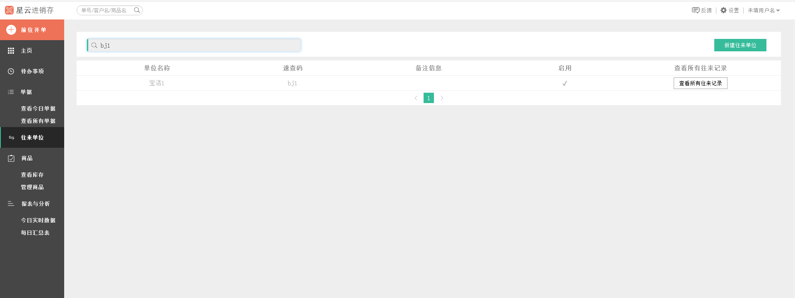
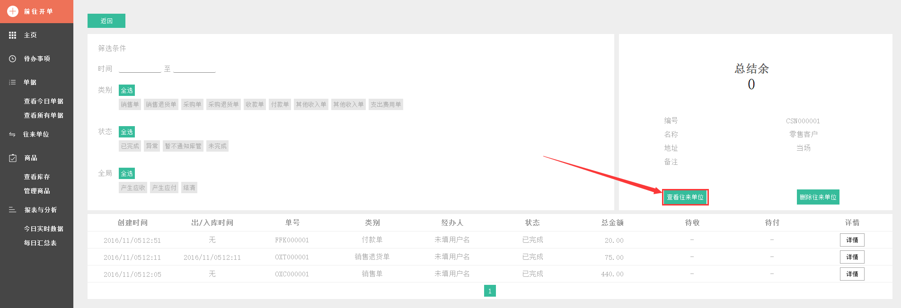
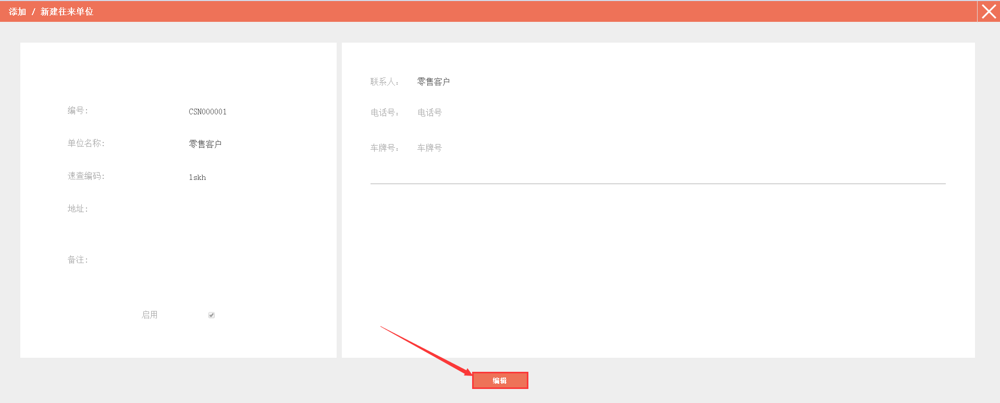
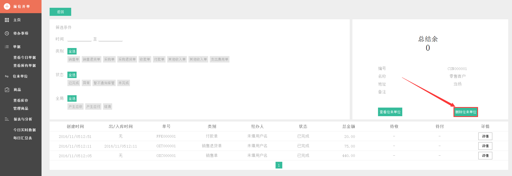
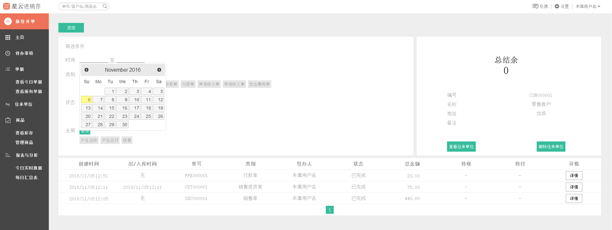
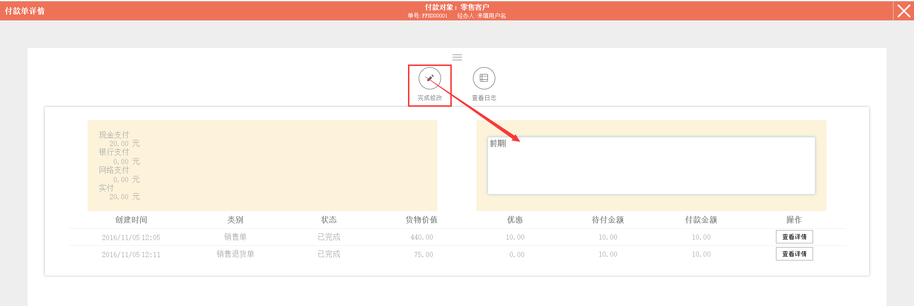
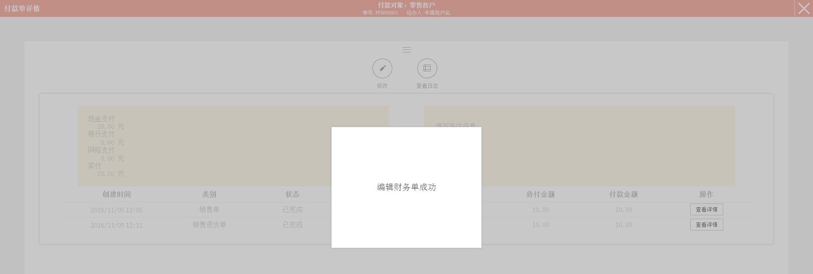
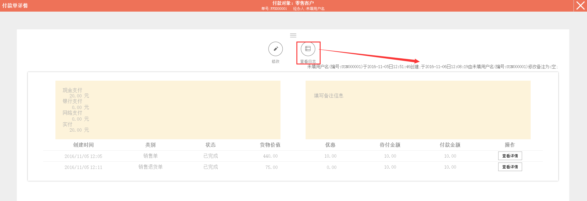

#6.5 往来单位
**所有交易往来的相关单位的查找与搜索。**

	- 搜索往来单位
	- 查看所有往来记录

###1 搜索往来单位
>搜索想要查看的往来单位的信息及记录，而数据库中的往来单位数据众多，可通过直接键入搜索栏进行查找相应公司。搜索可通过单位名称和速查码进行搜索。

# 
###.2 查看所有往来记录
>1、点击列表右侧`查看所有往来记录`，可查看相应公司的往来记录列表。

>2、如果要查看或重新编辑往来单位的详细信息，可点击右侧`查看往来单位`。

>3、重新编辑往来单位信息，可点击下侧的`编辑`键，进行编辑。

>编辑注意点，详见.1新建往来单位步骤3-8。

>4、如果**从来没有进行过交易往来**，才可以删除往来单位，可直接点击`删除往来单位`来进行删除；只要有交易往来，其他任何情况都不可以删除往来单位。

>5、可筛选相应的条件（时间、类别、状态、全局）筛选出该公司相应的往来记录。

>6、点击`详情`，可查看到该单号的付款单详情。

>7、如果要修改备注信息和查看该记录的日志，可点击`☰`按钮，进行操作。

>点击`修改`，修改备注。

>再次点击`完成修改`，才完成备注的修改。

>点击`查看日志`，查看该记录的日志。

>再次点击`查看日志`，可收起该记录的日志内容。

>再次点击`☰`,可收起`修改`和`查看日志`按钮。

>8、如果想要进一步查看不同单据的详细情况，可点击右下角的`查看详情`，查看更为详细的信息。

>9、点击`×`，返回上一级。

